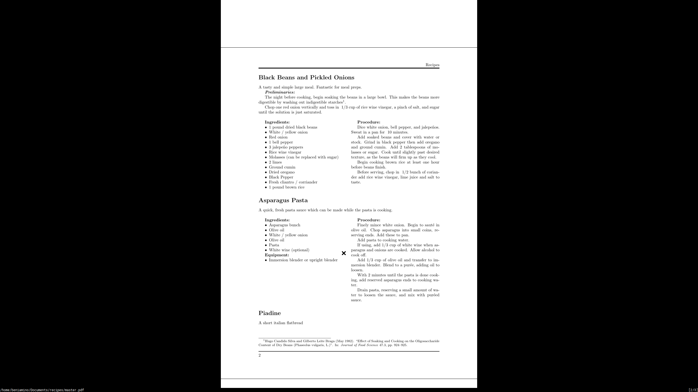

# recipes

  

## Adding a Recipe

The process for adding a recipe is simple. Just fork the repo, and add a recipie using the .example.tex template in the recipes folder. Make sure to list the recipe in the master.tex file before creating a pull request. 
